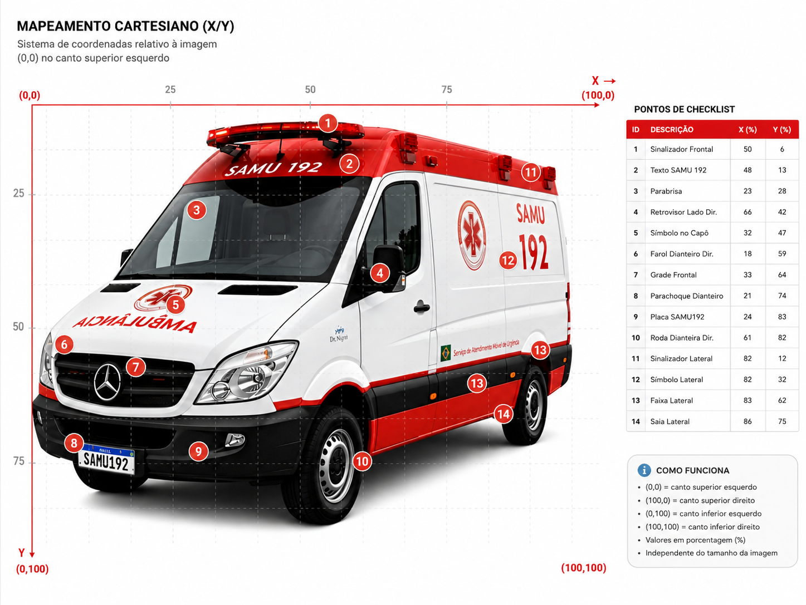

# 🚑 MAPEAMENTO CARTESIANO CHECKLIST NUTRAN

Ferramenta de **mapeamento cartesiano** para checklist visual de viaturas do SAMU. Permite posicionar pontos de inspeção sobre imagens reais dos veículos usando coordenadas percentuais (0–100).


## ✨ Funcionalidades

- **Seleção por tipo de veículo** — dropdown agrupa por marca/modelo (Mercedes Sprinter, Renault Master, Toyota SW4, Yamaha Versys)
- **Múltiplas vistas** — cada veículo possui imagens de frente/lateral e traseira, navegáveis por abas
- **Modo lado a lado** — visualize frente e traseira simultaneamente no modo dual
- **Pontos únicos por tipo** — cada item de checklist pertence a uma única imagem, sem duplicações entre frente e traseira
- **Coordenadas percentuais** — sistema (0,0) no canto superior esquerdo a (100,100) no inferior direito
- **Click-to-place** — clique na imagem para capturar coordenadas automaticamente
- **Persistência local** — dados salvos em `localStorage`
- **Exportação JSON** — todos os pontos mapeados exportáveis em formato JSON

## 🗂️ Veículos exibidos no app

| Veículo | Tipo | Imagens |
| --------- | ------ | --------- |
| Mercedes Sprinter | USB / USA / USI | Frente/Lateral + Traseira |
| Renault Master | USB / USA / USI | Frente/Lateral + Traseira |
| Toyota SW4 | VIR / VIM | Frente + Traseira |
| Yamaha Versys | Motolância | Frente + Traseira |

## 🚀 Como usar

1. Sirva os arquivos com qualquer servidor HTTP local:

   ```bash
   # Exemplo com Python
   python -m http.server 8017

   # Exemplo com Node
   npx serve -p 8017
   ```

2. Abra no navegador:

   ```text
   http://localhost:8017/
   ```

3. Selecione o tipo de veículo, escolha a vista (frente/traseira) e clique na imagem para posicionar pontos de checklist.

## 📁 Estrutura de pastas (atual)

```text
├── index.html
├── README.md
├── PROTOTIPO-DE-MAPEAMENTO-CARTESIANO.png
├── assets/
│   ├── css/
│   └── js/
│       ├── main.js
│       ├── dom.js
│       ├── events.js
│       ├── actions.js
│       ├── render.js
│       ├── state.js
│       ├── images.js
│       ├── storage.js
│       ├── utils.js
│       └── data/
│           ├── vehicles.js
│           └── checklist.js
├── imagens/
│   ├── MERCEDES-SPRINTER-USB-USA-USI/
│   │   ├── 1-FRENTE/
│   │   ├── 2-TRASEIRA/
│   │   └── REFERENCIA/
│   ├── RENAULT-MASTER-USB-USA-USI/
│   │   ├── 1-FRENTE/
│   │   ├── 2-TRASEIRA/
│   │   └── REFERENCIA/
│   ├── TOYOTA-SW4-VIR-VIM/
│   │   ├── 1-FRENTE/
│   │   ├── 2-TRASEIRA/
│   │   └── REFERENCIA/
│   ├── YAMAHA-VERSYS-MOTOLANCIA/
│   │   ├── 1-FRENTE/
│   │   ├── 2-TRASEIRA/
│   │   └── REFERENCIA/
│   ├── MERCEDES-SPRINTER-PMR/
│   │   └── REFERENCIA/
│   ├── PEUGEOT-EXPERT-VOP/
│   │   └── REFERENCIA/
│   └── RENAULT-MASTER-BARIATRICA/
│       └── REFERENCIA/
└── .gitignore
```

## 🧭 Organização adotada

- Todas as imagens ficam em `imagens/` na raiz do projeto.
- As pastas de veículos usam **caixa alta** (ex.: `MERCEDES-SPRINTER-USB-USA-USI`).
- As imagens ativas do app ficam em `1-FRENTE/` e `2-TRASEIRA/`.
- Materiais de apoio ficam em `REFERENCIA/` dentro da mesma pasta de cada veículo.
- A configuração dos veículos ativos permanece centralizada em `assets/js/data/vehicles.js`.

## 📝 Nomenclatura de imagens

As imagens ativas seguem o padrão:

```text
V{versão}-{MARCA}-{MODELO}-{VISTA}.{ext}
```

Exemplo: `V2-MERCEDES-SPRINTER-FRENTE.jpg`
Somente a versão mais alta encontrada por vista (frente/traseira) é carregada automaticamente.

## ➕ Como adicionar ou atualizar uma viatura ativa

1. Criar/usar a pasta `imagens/<NOME-DO-VEICULO-EM-CAIXA-ALTA>/`.
2. Manter as imagens em `1-FRENTE/` e `2-TRASEIRA/`.
3. Colocar imagens de referência em `REFERENCIA/` na mesma pasta do veículo.
4. Nomear arquivos seguindo o padrão com versão (`V1`, `V2`, ...).
5. Atualizar `assets/js/data/vehicles.js` com `id`, `label`, `folder`, `prefix` e `extensions`.

## 🔧 Tecnologias

- HTML5, CSS3, JavaScript (Vanilla)
- Sem dependências externas
- Responsivo (desktop, tablet, mobile)
- `localStorage` para persistência
